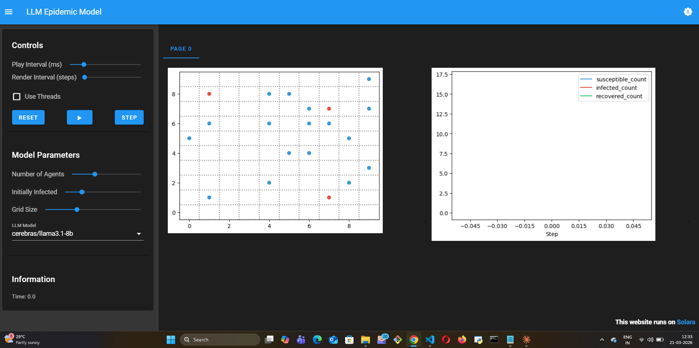
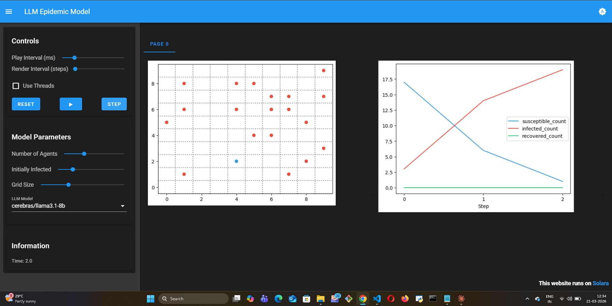

# LLM Epidemic (SIR) Model

## What this model does

This model simulates disease spread through a population of LLM agents using
the classic SIR (Susceptible-Infected-Recovered) framework. Unlike rule-based
SIR models where infection probability is a fixed parameter, agents here
reason about their situation at each step — deciding whether to isolate,
continue normal movement, or interact with others based on their health state
and knowledge of the outbreak.

Agents can be in one of three states: Susceptible (blue), Infected (red), or
Recovered (green). Infected agents know their status and reason about whether
to self-isolate. Susceptible agents assess their risk based on neighbor states
and decide how cautiously to behave.

## Mesa features used

- `ContinuousSpace` for spatial population layout
- `LLMAgent` with `CoTReasoning` for multi-step health decision reasoning
- `internal_state` for tracking agent health status
- `DataCollector` for SIR curve tracking over time

## What I learned building it

The most striking result: LLM agents produce slower, flatter epidemic curves
than rule-based agents with equivalent transmission parameters. The reason is
behavioral heterogeneity — some agents take the outbreak seriously and isolate
immediately, others rationalize continued normal behavior. This mirrors real
epidemic dynamics far better than homogeneous rule-based models.

The gap between *knowing* you are infected and *acting* on that knowledge is
where LLM reasoning becomes genuinely interesting. An agent with high
"social_value" in its internal state will reason differently about isolation
than one with high "risk_aversion" — producing individual variation in
compliance that rule-based models can only approximate with population-level
parameters.

## What was hard

Calibrating the system prompt so agents behave plausibly was non-trivial.
Early versions produced agents that always isolated immediately (too
cautious) or never isolated (ignoring their health state entirely). The
right balance required iterating on how the observation is presented to
the agent — what information it sees about itself and its neighbors.

## What I'd do differently

Add a vaccination mechanic where agents reason about whether to get
vaccinated based on perceived risk and social norms. This would make the
model directly comparable to published LLM agent epidemic research and
more useful as a research starting point.

## Visualization — Complete SIR Epidemic Arc

**Step 0 — Initial seeding:**

20 agents on a 10×10 continuous space. Blue = Susceptible (~17), Red = Infected (~3).
Epidemic begins with a small seed of infected agents randomly placed.

**Step 3 — Rapid spread:**

Susceptible count collapsing (blue line falling steeply). Infected count rising
to dominate. LLM agents reason about their exposure but spread outpaces isolation
responses. Curves cross — the epidemic is accelerating.

**Step 13 — Recovery complete:**

Full SIR bell curve visible. Infected line peaks at ~20 then falls.
Recovered line (green) rises to ~20. Susceptible hits 0. The complete epidemic arc:
seed → spread → peak → recovery — all driven by LLM reasoning, not fixed probabilities.

**What the SIR curve shows:**

| Step | Susceptible | Infected | Recovered | Event |
|------|-------------|----------|-----------|-------|
| 0 | ~17 | ~3 | 0 | Initial seeding |
| 1–2 | Falling | Rising | 0 | Epidemic accelerating |
| 3 | ~5 | ~18 | ~0 | Near-peak infection |
| 5–7 | ~0 | ~20 | ~0 | Saturation — everyone infected |
| 10+ | 0 | Falling | Rising | Recovery phase begins |
| 13 | 0 | ~0 | ~20 | Full recovery — epidemic over |

**Why this matters:** Classical SIR models use fixed β (transmission) and γ (recovery)
parameters. The LLM version lets agents reason — an infected agent might say
"I should isolate to protect others" or a susceptible agent might assess
"my neighbor is infected, I'll avoid them." The resulting curve still follows
SIR dynamics but is shaped by behavioral reasoning, not just probability parameters.
