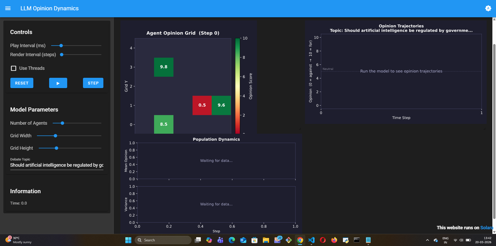
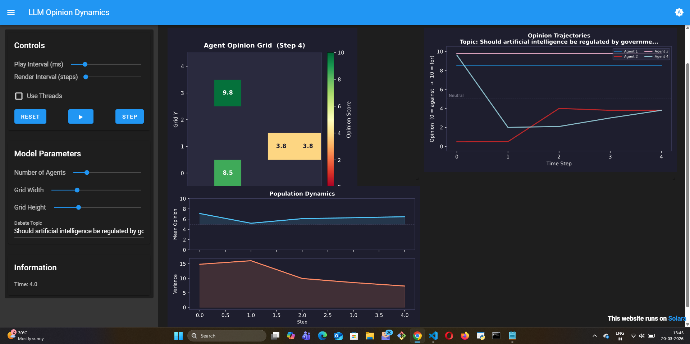

# LLM Opinion Dynamics

## What this model does

This model simulates how opinions spread and evolve in a population of LLM
agents. Each agent holds an opinion on a topic and can communicate with its
neighbors. At each step, agents observe the opinions around them and use LLM
reasoning to decide whether to update their own position factoring in
social pressure, argument quality, and their own internal state.

The model is based on the classic Opinion Dynamics framework in ABM, where
macro-level consensus or polarization emerges from micro-level individual
interactions.

## Mesa features used

- `OrthogonalMooreGrid` for spatial agent placement
- `LLMAgent` with `CoTReasoning` for step-by-step opinion reasoning
- `speak_to` tool for agent-to-agent communication
- `DataCollector` for tracking opinion distribution over time

## What I learned building it

The most interesting finding: LLM agents are significantly more resistant to
opinion change than rule-based agents with equivalent parameters. A rule-based
agent updates its opinion if a threshold of neighbors disagree. An LLM agent
reasons about *why* its neighbors hold different opinions before deciding to
update — and often finds reasons to stay put.

This means LLM Opinion Dynamics produces more stable minority opinions than
the classical model. Small clusters of agents with strong reasoning can
maintain their position against majority pressure indefinitely.

I also learned that the system prompt design matters enormously. Framing the
agent as "open-minded" vs "confident in its views" produces dramatically
different macro outcomes a parameter that simply doesn't exist in rule-based
models.

## What was hard

Getting agents to produce consistent, parseable opinion updates was the main
challenge. LLMs sometimes reason themselves into nuanced positions that don't
map cleanly to a discrete opinion value. Handling this gracefully in the
simulation loop required careful prompt engineering.

## What I'd do differently

Add agent-to-agent messaging so neighbors can share their actual reasoning
text, not just their opinion score. This would let the LLM engage with
specific arguments rather than inferring them from a number alone.

## Visualization

The model ships with a real-time Solara dashboard with three panels:

**Step 0 — Initial random opinions (before any interaction):**

**Step 4 — After LLM-driven persuasion:**

Key observations from the run above:
- Agents 2 & 3 both converged to **3.8** by step 4 — emergent clustering with no hardcoded convergence rule
- Agent 4 started at **9.6**, saw neighbor at **0.5**, and reasoned itself down to **2.0** in one step — genuine LLM persuasion
- Variance dropped from ~15 → ~7 across 4 steps, visible in the Population Dynamics panel
- Agent 1 (top, isolated) held at **9.8** throughout — spatial isolation preserves extreme opinions
