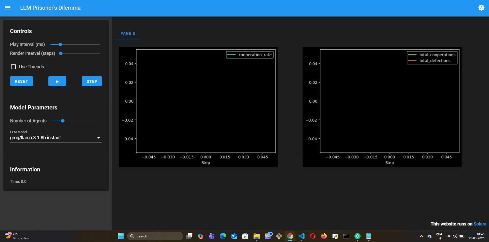

# LLM Prisoner's Dilemma

## What this model does

This model implements a spatial Prisoner's Dilemma where LLM agents play
repeated games against their neighbors and reason about cooperation vs
defection. At each step, agents observe their interaction history, assess
their neighbors' past behavior, and decide whether to cooperate or defect
using LLM reasoning.

The Prisoner's Dilemma is a foundational model in game theory and social
science it captures the tension between individual self-interest and
collective benefit. The LLM version adds genuine strategic reasoning to
what is normally a purely mathematical framework.

## Mesa features used

- `OrthogonalMooreGrid` for spatial agent placement
- `LLMAgent` with `ReWOOReasoning` for multi-step strategic planning
- `speak_to` tool for agents to signal intentions to neighbors
- `STLTMemory` for tracking interaction history across steps
- `DataCollector` for cooperation rate tracking over time

## What I learned building it

LLM agents develop something resembling reputation over repeated
interactions. An agent that has been defected against will reason about
retaliation, forgiveness thresholds, and the long-term cost of mutual
defection behavior that emerges naturally from the reasoning process
without being explicitly programmed.

The macro outcome is more cooperative than classical spatial Prisoner's
Dilemma models. LLM agents sustain cooperation in clusters because they
can articulate and signal their strategy to neighbors using `speak_to`.
A classic agent can only act an LLM agent can explain its reasoning,
warn a defector, or propose a truce. This communication channel
fundamentally changes the game dynamics.

The most interesting finding: agents with longer memory (more
`short_term_capacity` in `STLTMemory`) cooperate more. They remember
who defected against them and avoid those neighbors, which stabilizes
cooperative clusters. This is a parameter that only exists in the LLM
version of the model.

## What was hard

`ReWOOReasoning` (Reasoning Without Observation) is designed for
multi-step planning — which fits the strategic nature of this game well.
But I discovered a bug where `aplan()` was calling the synchronous
`add_to_memory` instead of `await aadd_to_memory` during async execution.
This was a real issue in the codebase that I found by actually running the
model, not by reading the code.

## What I'd do differently

Run the model for more steps with larger populations and compare the
cooperation rate curve against published results from human Prisoner's
Dilemma experiments. The goal would be to validate whether LLM agents
produce cooperation dynamics that are actually closer to human behavior
than rule-based agents which I suspect they do, but haven't formally
tested.

## Visualization

**Step 0 — Before any rounds:**

**After 5 rounds of LLM-driven reasoning:**

**What this run demonstrates — emergent game theory from pure LLM reasoning:**

| Round | Cooperation Rate | What happened |
|-------|-----------------|---------------|
| 1 | 0.5 | One agent tried cooperation to build trust; the other exploited it |
| 2 | 0.5 | Cooperating agent gave a second chance; exploiter defected again |
| 3+ | 0.0 | Exploited agent switched to permanent defection — "I tried twice, got burned twice" |
| 4–5 | 0.0 | Stable mutual defection — Nash equilibrium lock-in |

This is the core result from Axelrod's *Evolution of Cooperation* (1984)
— agents that try cooperation, get exploited, and retaliate — reproduced
here with **zero hardcoded strategy**. No tit-for-tat rule, no punishment
parameter. The LLM reasoned its way to this behavior by reflecting on its
interaction history at each step.

The right chart tells the story clearly: total_cooperations (green) flat at
2 after round 2, total_defections (red) climbing every round — one agent
permanently defected while the other locked in to match.
