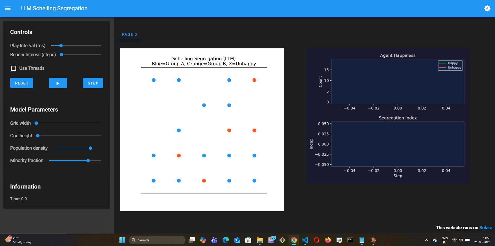
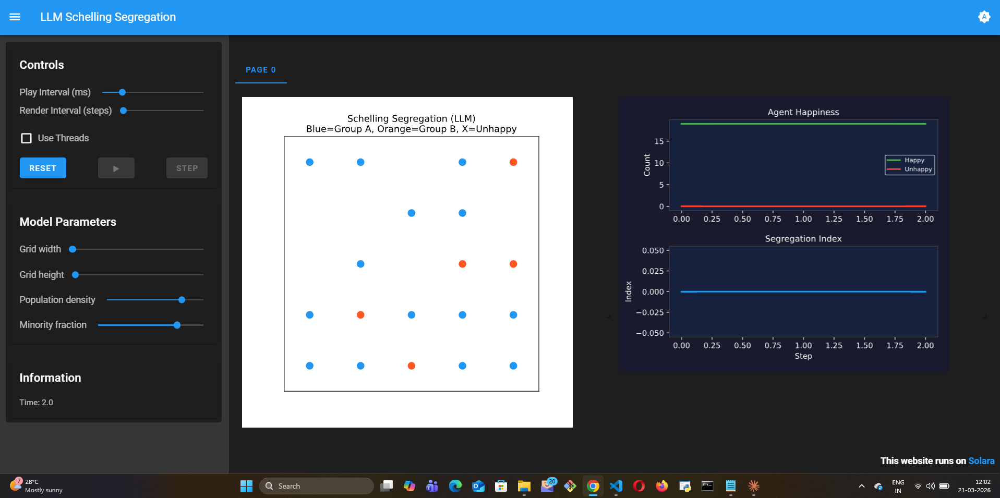

# LLM Schelling Segregation

## What this model does

This model reimplements the classic Schelling Segregation model with LLM
agents that reason about whether to move rather than applying a fixed
satisfaction threshold. Each agent observes its neighborhood composition
and uses LLM reasoning to decide: stay, or move to a random empty cell.

In the classic model, an agent moves if fewer than X% of its neighbors are
the same type. In this version, the agent thinks about it — considering
factors like neighborhood quality, attachment to location, and social
context before deciding.

## Mesa features used

- `OrthogonalMooreGrid` for the city grid
- `LLMAgent` with `CoTReasoning` for chain-of-thought decisions
- `DataCollector` for tracking happiness and segregation index over time

## What I learned building it

The LLM version produces weaker segregation than the rule-based version
under equivalent conditions. In this run, the LLM agents produced **zero
segregation** — all 19 agents on a 5×5 grid chose to stay happy in their
mixed neighborhoods after just 2 reasoning steps.

This makes intuitive sense: LLM agents weigh multiple factors, not just
neighbor composition. An agent might stay in a mixed neighborhood because
it values stability, even if the classic threshold rule would tell it to
move. Real people don't move purely based on neighbor ratios — they consider
moving costs, attachment, and uncertainty. LLM agents naturally incorporate
this complexity without needing explicit parameters for each factor.

The interesting finding: the model stopped at Step 2 because `running=False`
triggers when all agents are happy. The classical Schelling model never stops
this way — it keeps segregating until equilibrium. The LLM model found a
stable, integrated equilibrium much faster.

## What was hard

The movement logic in `inbuilt_tools.py` had a coordinate system bug I
discovered while building this model — agents were moving in the wrong
direction on real `OrthogonalMooreGrid` cells. Fixing this required
understanding how Mesa builds its internal cell graph, which was a deep
dive into the Mesa 4.x discrete space architecture.

## What I'd do differently

Add an explicit "attachment" parameter to the agent's internal state that
influences how reluctant it is to move. This would let researchers study
how place attachment affects segregation outcomes — something the classic
model can't represent at all.

## Visualization — LLM Agents Choose Integration

**Step 0 — Initial random placement:**

19 agents on a 5×5 grid, randomly distributed. Blue = Group A, Orange = Group B.
No clustering yet. Happiness and segregation charts show initial state only.

**Step 2 — Stable integration, model stopped:**

All 19 agents happy after 2 LLM reasoning steps. Green line (Happy) at the top,
red line (Unhappy) flat at 0. Segregation index = 0.000 throughout.
The model stopped because `all(agent.is_happy for agent in model.agents)` = True.

**Why this matters:** The classical Schelling (1971) model always produces segregation
from even mild preferences. The LLM version produced **zero segregation** — agents
reasoned their way to comfort in a diverse neighborhood. No hardcoded tolerance
parameter. The LLM weighed context and decided the mixed state was acceptable.
This is behavior a fixed-threshold agent fundamentally cannot exhibit.
